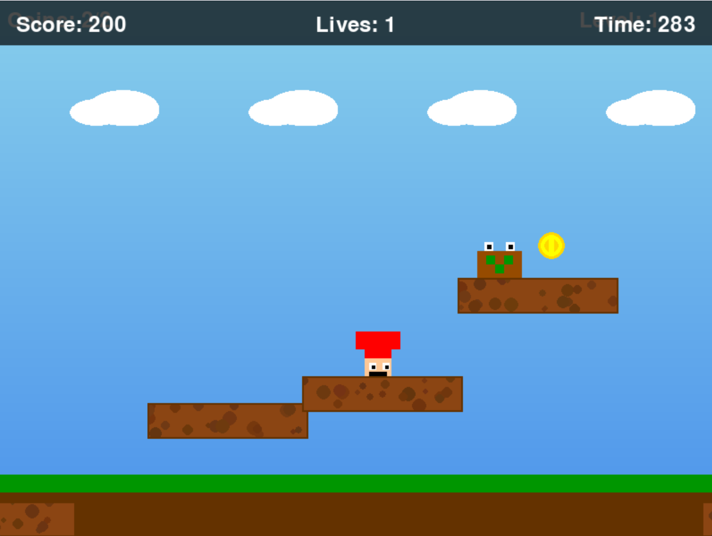

# 🍄 Super Mario Platformer (Pygame)

[](https://www.python.org/)
[](https://www.pygame.org/)
[](https://opensource.org/licenses/MIT)

A 2D side-scrolling platformer game inspired by the classic **Super Mario** series, entirely built using Python and the Pygame library. This project showcases object-oriented programming, game physics, and state management.



## ✨ Features

- **🍄 Classic Mechanics**: Run, jump, collect coins, and defeat enemies!
- **⬆️ Power-Ups**: Find mushrooms to grow bigger, run faster, jump higher, and survive an extra hit.
- **🗺️ Multiple Levels**: Three progressively challenging levels with unique layouts and increasing difficulty.
- **⚛️ Custom Physics**: Realistic gravity, jumping arcs, and collision detection systems.
- **🔊 Rich Audio**: Action-based sound effects and background music (with smart fallbacks if assets are missing).
- **💾 Save System**: Automatically saves your unlocked levels and high score between sessions using JSON.
- **🖥️ Complete UI**: Features a Main Menu, interactive Instructions, Pause Screen, and live in-game HUD.

---

## 🚀 Installation & Setup

1. **Clone the repository** (or download as ZIP):
   ```bash
   git clone https://github.com/YOUR-USERNAME/mario_game.git
   cd mario_game
   ```

2. **Install the dependencies**:
   Make sure you have Python 3.6 or later installed, then run:
   ```bash
   pip install -r requirements.txt
   ```

3. **Run the game**:
   ```bash
   python main.py
   ```

> *Note: If you plan on generating or editing custom sound assets using the tools in the `scripts/` directory, NumPy is required (already included in `requirements.txt`).*

---

## 🎮 How to Play

### Controls
| Key | Action |
| :--- | :--- |
| **Left / Right Arrows** | Move character |
| **Spacebar** | Jump |
| **Enter** | Start game / Next level |
| **P** or **Escape** | Pause / Unpause |
| **M** | Return to Main Menu |
| **R** | Restart Level (from Game Over or Pause menu) |

### Objectives
- Reach the **flag** at the end of each level to advance.
- Collect **coins** to increase your score (you need a certain percentage of coins to pass the level).
- **Defeat enemies** by jumping on top of them. Avoid touching them from the sides!
- Try to complete all 3 levels to win the game and set a new **High Score**.

---

## 📁 Project Structure

```text
mario_game/
├── assets/             # Game graphics and sound files
├── scripts/            # Helper scripts for generating placeholder assets
├── game_elements.py    # Classes for Platforms, Coins, Enemies, Powerups, Flags
├── level.py            # Level generation and logic
├── main.py             # Main game loop, UI, and state management
├── player.py           # Player physics, movement, and animations
├── settings.py         # Global variables, colors, and game tuning
├── requirements.txt    # Python dependencies
└── ...
```

---

## 🤝 Contributing

Contributions, issues, and feature requests are welcome!
Feel free to check out the issues page if you want to contribute.

---

## 📄 License

This project is licensed under the MIT License - see the [LICENSE](LICENSE) file for details.